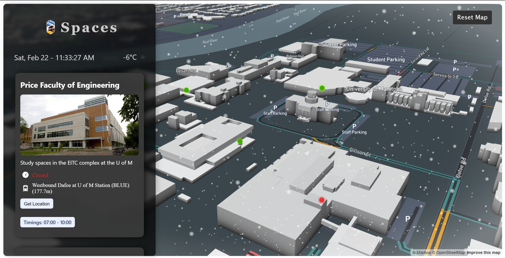

# 🚀 U of M Spaces 🏫
### 🌟 Dev Hacks 2025 Project - The Ultimate Navigation Guide for the University of Manitoba

Welcome to **U of M Spaces**, your **go-to platform** for discovering and navigating study spots, **hidden gems**, and essential locations at the **University of Manitoba**! 🎓

---

## 🌍 Why U of M Spaces?
🔹 **Find the Best Study Spots** at U of M 🏫  
🔹 **Real-time Availability** of Spaces 🕒  
🔹 **Navigate with Ease** using Google Maps Integration 🗺️  
🔹 **Customizable Spaces** - Users can add their own favorite spots ✍️  
🔹 **Amenities Finder** - Locate gyms, cafes, libraries, and more! 🏋️‍♂️☕📚  

---

## 📌 Current Features
✅ **Interactive Map** - View study spaces on a fully interactive, **3D-enhanced** map    
✅ **Collapsible Cards** - Detailed space info, including timings and images 📸  
✅ **Live Status Updates** - Know if a space is **open or closed** in real time  
✅ **Get Directions** - Navigate seamlessly to study spots with **Google Maps integration**  
✅ **Modern UI** - Dark theme with smooth animations 🌙✨  

---

## 🛠️ Future Features & Roadmap 🚀

🎯 **Smart Filters**
- Find spaces based on availability, quietness, and location

🎯 **🔐 User Authentication & Profiles**  
- Users can log in and save their favorite spaces  
- Personalized study spot recommendations  

🎯 **📍 Custom Space Creation**  
- Users can **add their own study spots** with location & details  
- Community-driven navigation for discovering **hidden gems**  

🎯 **Detailed Information**  
- Add detailed information about each centre to improve user experience

🎯 **🏋️ Amenities & Facilities**  
- Locate **gyms, cafes, libraries, study lounges, and more**  
- Filters for quiet study zones, group study rooms, and **24/7 spaces**  

🎯 **🔄 Improved State Management**  
- **Redux Integration** for optimized **state management & performance**  
- Improved UI responsiveness  

---

## 📸 Screenshots and Videos

<video controls src="20250222-1735-01.6703026.mp4" title="Title"></video>

---

## 💻 Tech Stack
🔥 **React.js** - Frontend Framework  
🔥 **Mapbox GL** - Interactive Maps  
🔥 **Google Maps API** - Navigation & Directions  
🔥 **Redux (Upcoming)** - State Management  
🔥 **Firebase / Supabase (Upcoming)** - User Authentication & Database  

---

## 🎨 UI & Design
💠 **Modern & Clean UI** - Inspired by Google Material Design  
💠 **Dark Theme** - Designed for late-night study sessions 🌙  
💠 **Smooth Animations** - CSS Transitions & Glassmorphism Effects  

---

